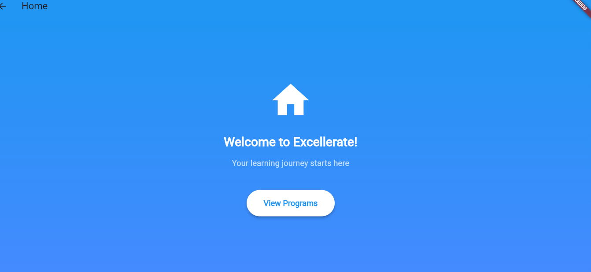
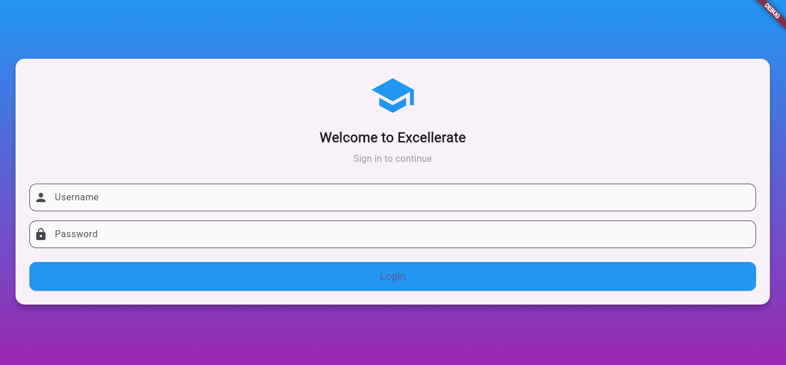
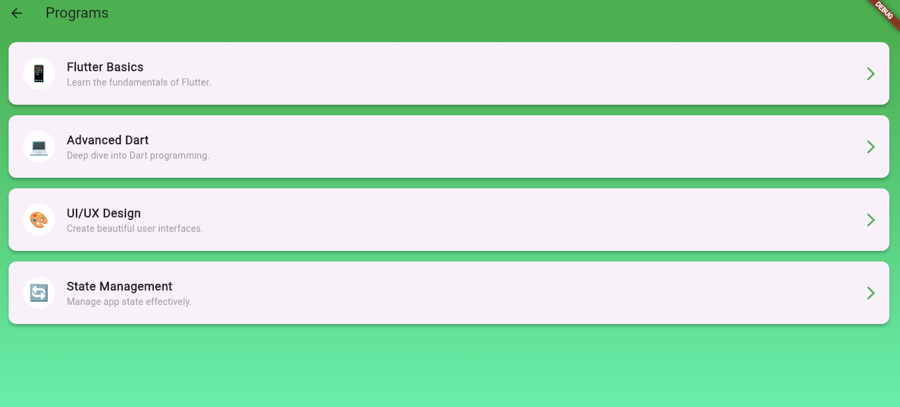
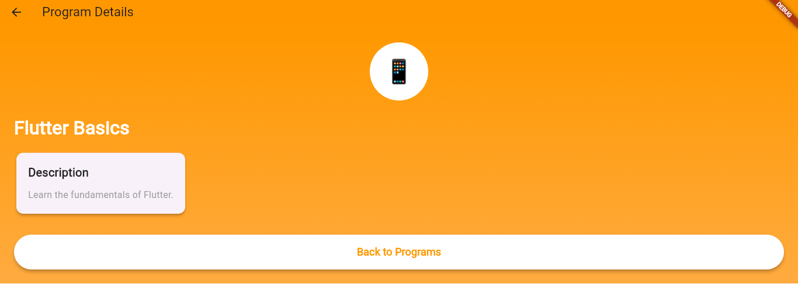
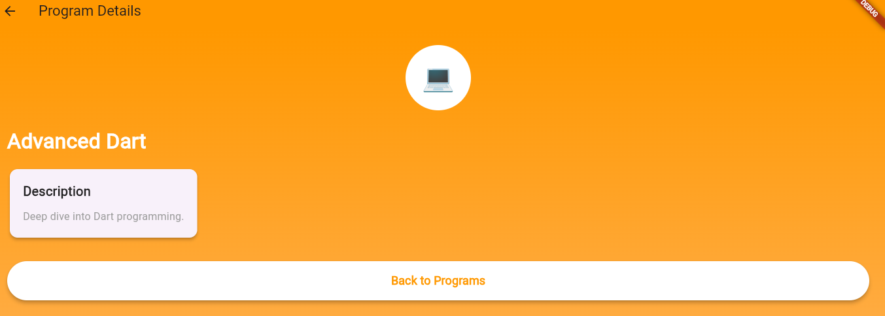
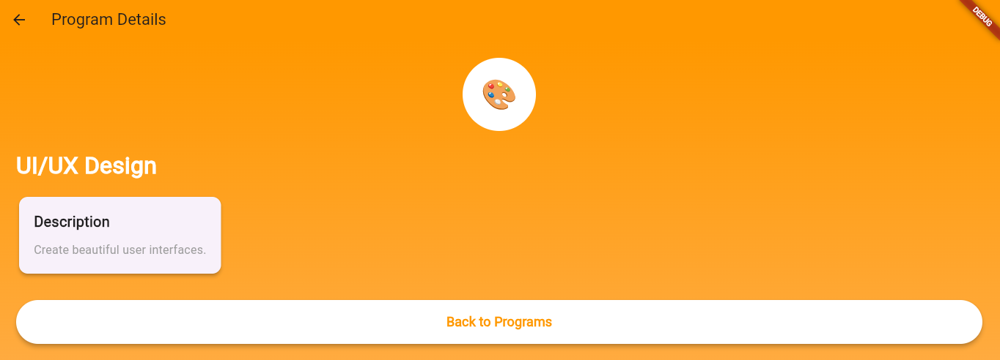
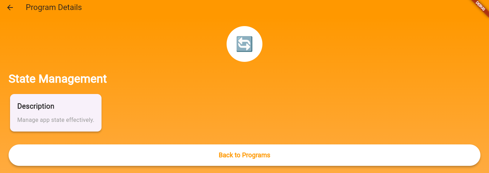

# Excellerate Learning Platform

## Recent Updates (October 30, 2025)

### New Features & Improvements
1. **Enhanced Program Listing Screen**
   - Added real-time search functionality
   - Implemented level-based filtering (Beginner, Intermediate, Advanced)
   - Smooth animations and transitions between screens
   - Better error handling and empty states

2. **Program Details Screen**
   - Redesigned UI with card-based layout
   - Added enrollment functionality with loading states
   - Interactive feedback system
   - Improved navigation and user experience

3. **Feedback System**
   - New feedback form with validation
   - Star rating component
   - Real-time form validation
   - Success/error state handling

4. **Data Integration**
   - Connected to mock API via JSON
   - Implemented ProgramService for data fetching
   - Added error handling and retry mechanisms
   - Efficient state management

## Purpose of the App

LearnLoop is designed to simplify and personalize the digital learning experience for both learners and administrators. It provides an intuitive, mobile-first platform where learners can access interactive courses, track progress, and receive real-time feedback while admins can easily manage users, content, and analytics.

The app aims to:
- Enhance engagement through personalized learning journeys.
- Centralize learning materials and progress tracking.
- Empower admins with easy management tools and insights.
- Foster continuous learning with accessible, on-demand content.

## Target Users

### Learners
- Students or professionals seeking structured, self-paced learning.
- Individuals looking for mobile, interactive, and gamified learning experiences.
- Users who value community-based and skill-focused education.

### Admins
- Course creators, teachers, or training managers.
- Responsible for managing learners, tracking performance, and curating learning materials.
- Require dashboards and analytics to measure engagement and progress.

## Key Features

### For Learners
- **User Profiles**: Personalized dashboards showing courses, progress, and achievements.
- **Course Library**: Access to all enrolled and available courses.
- **Progress Tracking**: Visual indicators (badges, streaks, completion bars).
- **Quizzes & Assignments**: Interactive assessments with instant feedback.
- **Gamification**: Points, leaderboards, and rewards to encourage engagement.
- **Offline Access**: Downloadable content for learning without internet.
- **Community Forums**: Peer interaction, Q&A, and collaborative discussions.

### For Admins
- **Admin Dashboard**: Manage learners, instructors, and courses.
- **Content Management**: Upload, edit, and organize learning materials.
- **User Management**: Assign roles, track activity, and manage access levels.
- **Analytics & Reports**: Insights into learner engagement, progress, and performance.
- **Notification System**: Announcements, reminders, and feedback alerts.
- **Integration**: Connect with third-party LMS tools or payment systems.

## Technology Overview
- **Frontend**: React Native (for cross-platform mobile apps). *Note: This project uses Flutter instead.*
- **Backend**: Node.js with Express / Firebase for scalability.
- **Database**: Firestore or MongoDB.
- **Authentication**: OAuth (Google, Email, SSO).
- **Analytics**: Built-in dashboards + Google Analytics integration.

## Example User Journeys

### Learner Journey
1. Sign Up/Login → via Google or Email.
2. Browse Courses → Views course catalog categorized by topic.
3. Enroll in a Course → Starts first lesson; progress auto-saves.
4. Complete Modules → Takes quizzes; earns badges.
5. View Progress → Dashboard updates completion rate.
6. Interact with Community → Asks questions or joins discussions.
7. Receive Certificate → Upon course completion, generates a downloadable certificate.

### Admin Journey
1. Login as Admin → Access dashboard.
2. Add a New Course → Uploads video lessons, PDFs, and quizzes.
3. Monitor Learners → Tracks completion rates and engagement levels.
4. Send Announcements → Posts updates or reminders.
5. Generate Reports → Downloads analytics summary for review.

## Expected Impact
- Increased learner engagement and retention.
- Simplified admin operations.
- Improved visibility into learning outcomes.
- Accessible education for all through an intuitive interface.

## Next Steps
- Finalize feature requirements.
- Design UI/UX mockups.
- Develop MVP (Minimum Viable Product).
- Conduct beta testing with selected users.
- Launch and iterate based on feedback.

## Getting Started

This project is a starting point for a Flutter application.

A few resources to get you started if this is your first Flutter project:

- [Lab: Write your first Flutter app](https://docs.flutter.dev/get-started/codelab)
- [Cookbook: Useful Flutter samples](https://docs.flutter.dev/cookbook)

For help getting started with Flutter development, view the
[online documentation](https://docs.flutter.dev/), which offers tutorials,
samples, guidance on mobile development, and a full API reference.
 

## Screenshots      

### Homepage

### Login

### Program Listing 

### Program Details

### Program Details

### Program Details

### Program Details

## Additional screenshots

### Screenshot 21

### Screenshot 22

### Screenshot 23

### Screenshot 24

### Screenshot 25

### Screenshot 26

### Screenshot 27

### Screenshot 28

### Screenshot 29
